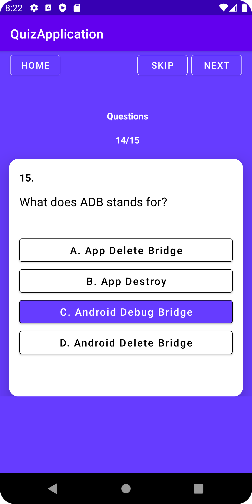

    
    <h2 align="center">Quiz on Android, Mobile Device Programming</h2>
    

<h2>Assignment 7</h2>

<table border="0">
      <tr>
        <td></td>
        <td></td>
        <td></td>
        <td></td>
    </tr>
    <tr>
        <td></td>
        <td></td>
        <td></td>
        <td></td>
    </tr>
      <tr>
        <td></td>
        <td></td>
        <td></td>
        <td></td>
    </tr>
     <tr>
        <td></td>
        <td></td>
        <td></td>
        <td></td>      
    </tr>
     <tr>
        <td></td>
        <td></td>
        <td></td>
        <td></td>
      
    </tr>
     <tr>
        <td></td>
        <td></td>
        <td></td>
      
    </tr>
</table>

